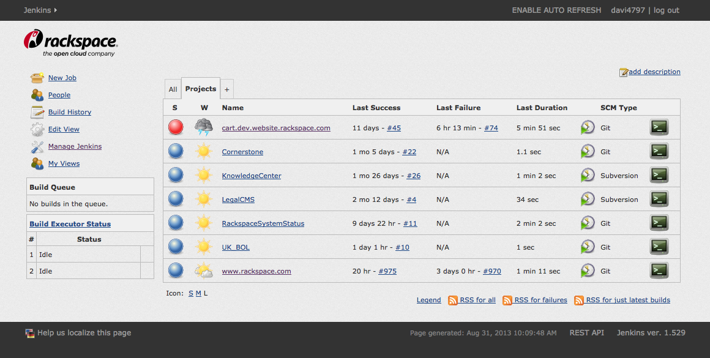

# Canon for Jenkins

CSS and JS to implement [Rackspace Canon](http://canon.rackspace.com/) as a theme for [Jenkins CI](http://jenkins-ci.org/).



## To Build
```
npm install
grunt
```

## Usage

1. Install the [Simple Theme Plugin for Jenkins](https://wiki.jenkins-ci.org/display/JENKINS/Simple+Theme+Plugin)
2. Navigate to Jenkins > configuration > Theme
3. Set _URL of theme CSS_ to `http://raw.dev.website.rackspace.com/rswebteam/canon-jenkins/raw/master/style.css` (or another URL of your setting/choosing)
4. Set _URL of theme JS_ to `http://raw.dev.website.rackspace.com/rswebteam/canon-jenkins/raw/master/app.js` (or another URL of your setting/choosing)

## Pro Tips

### If Jenkins blows up using these URLs

Remove settings from `$JENKINS_HOME/org.codefirst.SimpleThemeDecorator.xml`
