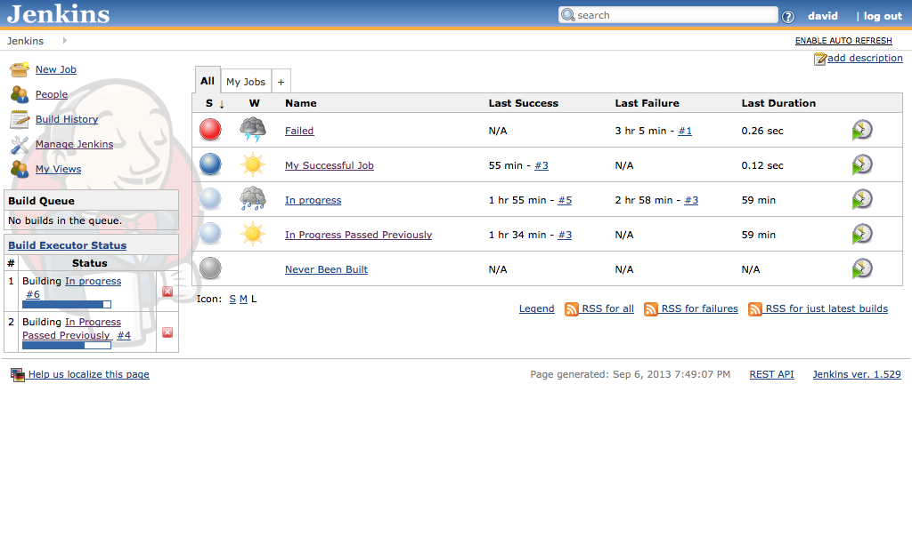
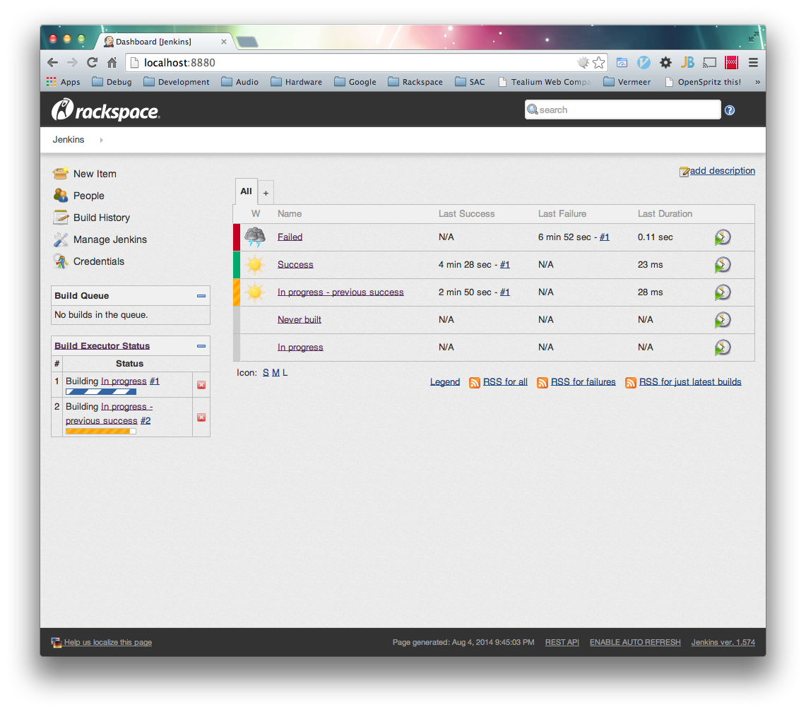

# Jenkins Rackspace Canon(tm) Theme

CSS and JS to implement [Rackspace Canon](http://canon.rackspace.com/) as a theme for [Jenkins CI](http://jenkins-ci.org/).

### Before



### After



## CDN URLs

### HTTP

CSS: http://css.cdn.rackspace.com/canon-jenkins/style.css

JS: http://js.cdn.rackspace.com/canon-jenkins/app.min.js

### HTTPS

CSS: https://8ab972673b5689e842a8-4ce0e842e9a020b19bb3a8bec8532674.ssl.cf1.rackcdn.com/canon-jenkins/style.css

JS: https://577351e10bc4a0198d93-f60a0bb748a3c84145bb10da7563bafb.ssl.cf1.rackcdn.com/canon-jenkins/app.min.js

**Note:** these URLs are for the Jenkins UI redesign as of 1.572. For the legacy UI theme files, please see `Legacy Jenkins UI (pre-1.572) CDN URLs` below

## Usage

1. Install the [Simple Theme Plugin for Jenkins](https://wiki.jenkins-ci.org/display/JENKINS/Simple+Theme+Plugin)
2. Navigate to Jenkins > Manage Jenkins > Configure System > Theme
3. Set _URL of theme CSS_ to `http://css.cdn.rackspace.com/canon-jenkins/style.css` (or another URL of your setting/choosing)
4. Set _URL of theme JS_ to `http://js.cdn.rackspace.com/canon-jenkins/app.min.js` (or another URL of your setting/choosing)

## Building

```
npm install
grunt
```

## To manually change SimpleTheme CSS and JS values

1. Edit: `$JENKINS_HOME/org.codefirst.SimpleThemeDecorator.xml` with code below
2. Restart Jenkins

```
<?xml version='1.0' encoding='UTF-8'?>
<org.codefirst.SimpleThemeDecorator plugin="simple-theme-plugin@0.3">
  <cssUrl>http://css.cdn.rackspace.com/canon-jenkins/style.css</cssUrl>
  <jsUrl>http://js.cdn.rackspace.com/canon-jenkins/app.min.js</jsUrl>
</org.codefirst.SimpleThemeDecorator>
```

## Legacy Jenkins UI (pre-1.572) CDN URLs

CSS: http://css.cdn.rackspace.com/canon-jenkins/legacy/style.css

JS: http://js.cdn.rackspace.com/canon-jenkins/legacy/app.min.js

### HTTPS

CSS: https://8ab972673b5689e842a8-4ce0e842e9a020b19bb3a8bec8532674.ssl.cf1.rackcdn.com/canon-jenkins/legacy/style.css

JS: https://577351e10bc4a0198d93-f60a0bb748a3c84145bb10da7563bafb.ssl.cf1.rackcdn.com/canon-jenkins/legacy/app.min.js
